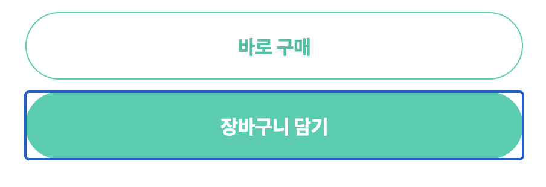
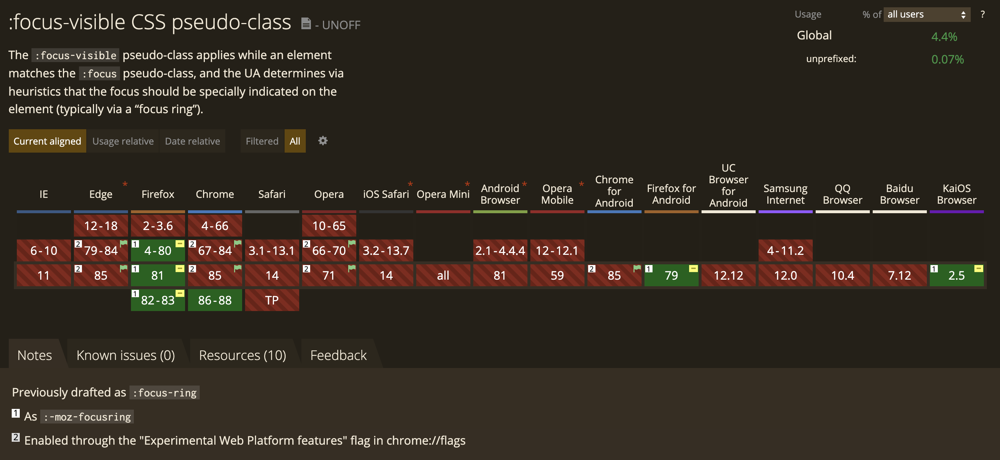

상호작용 가능한 컴포넌트를 개발하다 보면 브라우저의 기본 포커스 링(focus ring)을 마주하게 됩니다. 그리고 예상하지 않았던 디자인이라는 이유로 `outline: none;` 또는 `outline: 0;` 스타일을 적용하여 포커스 링을 숨겨버리는 경우가 종종 있습니다.



하지만 이는 키보드를 사용하거나 보조 기기에 의존하는 사용자가 페이지를 탐색하는 것을 매우 어렵게 만든다는 문제가 있습니다.

꽤 많은 사용자가 키보드를 사용합니다. 영구적, 또는 일시적으로 팔을 자유자재로 움직이 힘들거나, 단축키를 잘 알고 있어서 생산성을 향상하길 원하는 등 사용자마다 이유는 다양합니다. 웹사이트에서 올바른 키보드 지원은 모든 사용자에게 접근성을 향상시켜 줄 수 있는 중요한 접근성 규칙입니다.

키보드 사용자는 `Tab` 또는 `Shift + Tab` 키를 누르면서 `<a>`, `<button>`, `<input>` 과 같은 상호작용 가능한 엘리먼트를 포커스합니다. 만약 포커스 스타일이 없다면 사용자는 현재 포커스된 엘리먼트를 시각적으로 인지할 수 없습니다.

## `:focus` vs `:focus-visible`

하지만 포커스 스타일을 시각적인 이유만으로 제거하고 싶은 요구사항으로 인해 `outline: none;`, `outline: 0;` 스타일을 적용한다면 접근성에 하자가 생깁니다. 이런 경우에 `:focus-visible` 선택자를 활용하면 접근성을 헤치지 않고 포커스 링을 숨기는 딜레마를 해결할 수 있습니다.

`:focus-visible`은 `:focus`와 다르게, 마우스나 터치 같은 포인팅 기반 입력을 사용할 때는 적용되지 않고 키보드를 사용하여 포커스 할 때만 적용됩니다.

```css
:focus:not(:focus-visible) {
  outline: none;
}
```

## 브라우저 지원과 폴리필

안타깝게도 `:focus-visible`은 2020년 10월 기준으로 대부분의 브라우저에서 사용할 수 없습니다.



다양한 브라우저에서 지원하기 위해서는 `:focus-visible`을 자바스크립트로 구현한 [폴리필](https://github.com/WICG/focus-visible)을 사용할 수 있습니다.

npm으로 폴리필을 설치합니다.

```sh
$ npm install focus-visible
```

자바스크립트 코드 상단에서 폴리필을 불러옵니다.

```js
import 'focus-visible';
```

CSS는 아래와 같이 작성할 수 있습니다. 폴리필이 `<body>`에 `.js-focus-visible` class를 추가하고 키보드를 사용하여 포커스 하면 해당 요소에 `.focus-visible` class를 추가합니다.

```css
.js-focus-visible :focus:not(.focus-visible) {
  outline: none;
}
```

## 마무리

focus-visible은 UI의 비주얼과 접근성 사이에서 고민을 하고 있다면 합리적인 선택 방법으로 고려해보면 좋은 기능입니다. 더 많은 브라우저가 지원하여 폴리필 없이 사용 가능할 수 있기를 기대합니다.
